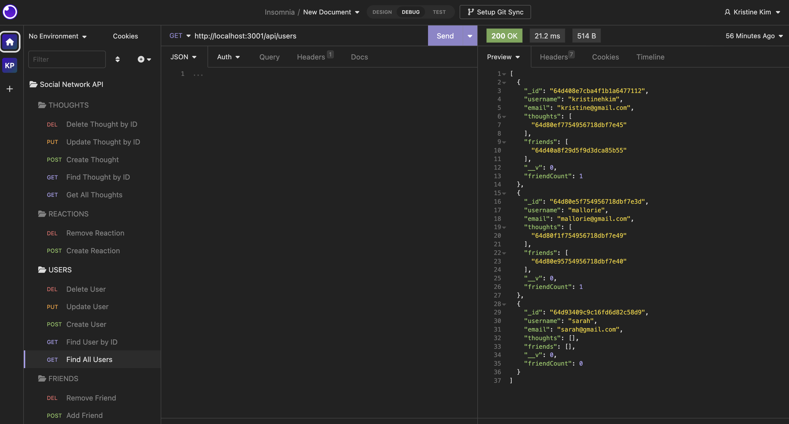

# Social Network API
> This is a social network web application where users can be created and they can share their thoughts, react to friends' thoughts, and create a friend list.  This application is using Express.js for routing, a MongoDB database, and the Mongoose ODM.
> Walkthrough Video [_here_](https://drive.google.com/file/d/1PaZ6Fm5h5d2_Abd7AyYDrz7KoHE2IzUH/view). <!-- If you have the project hosted somewhere, include the link here. -->

## Table of Contents
* [General Info](#general-information)
* [Technologies Used](#technologies-used)
* [Features](#features)
* [Screenshots](#screenshots)
* [Setup](#setup)
* [Usage](#usage)
* [Project Status](#project-status)
* [Acknowledgements](#acknowledgements)
* [Contact](#contact)
<!-- * [License](#license) -->

## General Information
When the commands are entered to invoke the application, the server is started and the Mongoose models are synced to the MongoDB database.  Open API GET routes in Insomnia to get all users and thoughts or get a user or thought by ID.  All the data will be displayed in a formatted JSON.  API POST, PUT, and DELETE routes can be tested in Insomnia in order to create, update, and delete users and thoughts in the database.  Also, API POST and DELETE routes can be tested to successfully create and delete reactions to thoughts and add and remove friends to a user's friend list.
<!-- You don't have to answer all the questions - just the ones relevant to your project. -->

## Technologies Used
- Express
- MongoDB
- Mongoose
- Node
- Nodemon

## Features
List the ready features here:
- Create a user.
- Add a reaction to a thought that a user made.
- Users can add a friend which will be added to a friend list.

## Screenshots

<!-- If you have screenshots you'd like to share, include them here. -->

## Setup
What are the project requirements/dependencies? Where are they listed? A requirements.txt or a Pipfile.lock file perhaps? Where is it located?

Proceed to describe how to install / setup one's local environment / get started with the project.

In order to get set up for this app, `npm i` to install all the packages and dependencies and `npm run dev` to invoke the application and start the server using Nodemon or `npm run start`.  Insomnia was used to test all the routes.

## Usage

`npm i` to download all dependencies and devdependencies

`npm run dev` to start Nodemon or `npm run start`

## Project Status
Project is: _in progress_.

## Acknowledgements
- Many thanks to my instructor, Michael Pacheco, the TAs, Nirav and Julius, tutor Dane Shrewsbury, and all the AskBCS learning assistants.

## Contact
Created by Kristine Kim.  Feel free to contact me at kristinehkim@gmail.com!

<!-- Optional -->
<!-- ## License -->
<!-- This project is open source and available under the [... License](). -->

<!-- You don't have to include all sections - just the one's relevant to your project -->